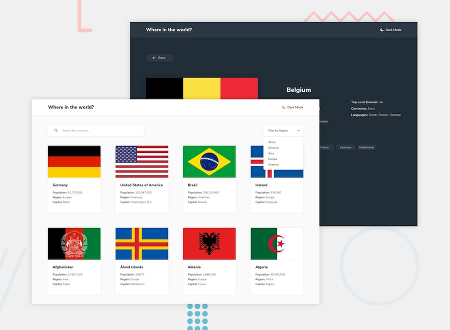

# Frontend Mentor - REST Countries API with color theme switcher

# [Demo online](https://fmcountry.surge.sh/)

## TOOLS

- JavaScript
- Sass
- Vite

## TODO

- [x] See all countries from the API on the homepage
- [x] Search for a country using an input field
- [x] Filter countries by region
- [x] Click on a country to see more detailed information on a separate page
- [x] Click through to the border countries on the detail page
- [x] Toggle the color scheme between light and dark mode (optional)